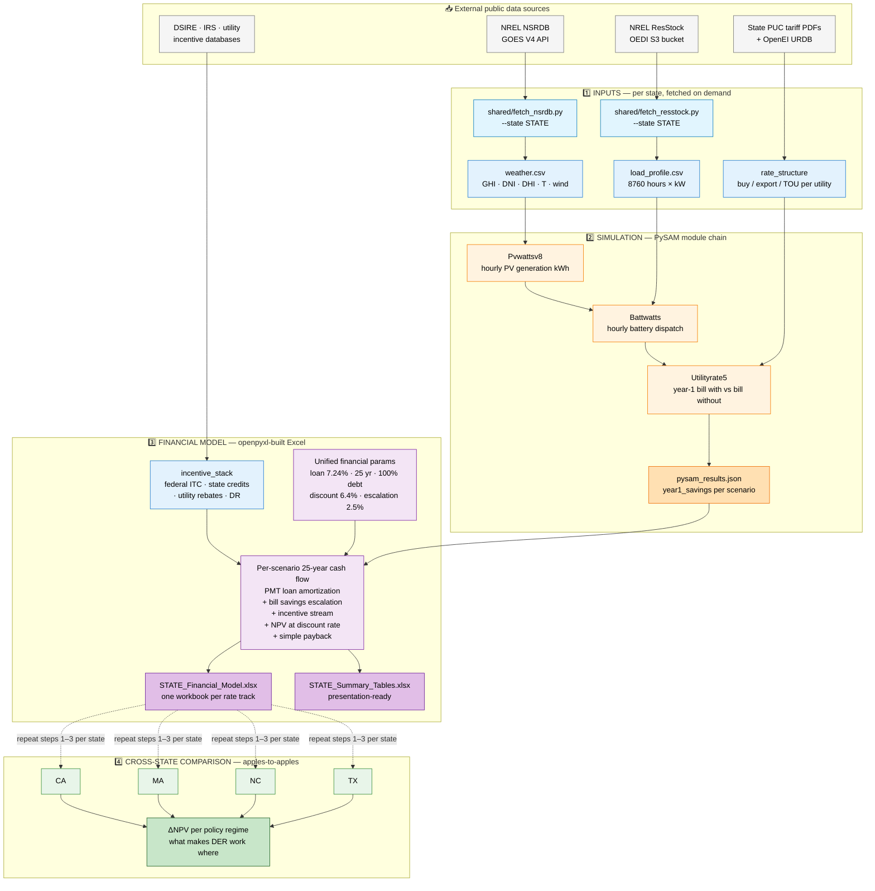

# DER Financial Viability Analysis — Replicable Package

> Public reproducibility package for the Duke Nicholas School of the Environment MEM 2026 master's project on residential Distributed Energy Resources (DER) rate and tariff economics.

This repository contains the data, code, financial models, and documentation needed to reproduce **four US state-level case studies** (CA, MA, NC, TX) of residential solar-plus-storage economics under each state's prevailing rate structure. (A fifth state, NY, is held out of this initial release pending collaborator review.)

## Pipeline at a glance

The same four-step pipeline runs in every state, with state-specific rate structures and incentives plugged in at the appropriate stage:



The unified parameters in stage 3 are what make cross-state comparison apples-to-apples: any ΔNPV between states reflects policy + rate differences, not financing assumptions. See [`docs/parameters.md`](docs/parameters.md) for full sourcing.

---

## What's inside

| Path | Contents |
|---|---|
| `case_studies/{CA,MA,NC,TX}/` | Per-state inputs, code, financial models, outputs, sources |
| `shared/` | NSRDB weather + NREL ResStock load-profile fetch utilities |
| `docs/` | Cross-state methodology and unified parameter table |
| `WORKFLOW.md` | Original four-step methodology document |
| `AGENTS.md` | Runbook for AI agents (Claude Code, Codex, etc.) reproducing the analyses |

## Quick start

```bash
# 1. Clone
git clone https://github.com/zl396/DER-Financial-Viability-Analysis-Replicable-Package-Duke-NSOE-MEM-2026.git
cd DER-Financial-Viability-Analysis-Replicable-Package-Duke-NSOE-MEM-2026

# 2. Install Python deps (Python 3.11+ recommended; conda preferred on Apple Silicon for PySAM)
python -m venv .venv && source .venv/bin/activate
pip install -r requirements.txt

# 3. Add your free NSRDB API key
cp .env.example .env
# Edit .env: register at https://developer.nrel.gov/signup/, paste your key + email

# 4. Fetch raw inputs for one state (e.g. NC, the smallest)
python shared/fetch_resstock.py --state NC
python shared/fetch_nsrdb.py  --state NC

# 5. Build the financial model (writes Excel under case_studies/NC/Financial Models/)
python "case_studies/NC/Financial Models/build_model.py"
```

See [`AGENTS.md`](AGENTS.md) for the full per-state pipeline and `docs/` for the methodology.

## Methodology summary

For each state, the unified pipeline is:

1. **Inputs** — representative residential load profile (NREL ResStock, fetched on demand), hourly weather (NSRDB, fetched on demand), state utility rate structure (URDB + tariff PDFs), incentive programs.
2. **Simulation** — PySAM `Pvwattsv8` + `Battwatts` + `Utilityrate5` for hourly PV generation, battery dispatch, and bill-with vs. bill-without calculations.
3. **Financial model** — 25-year cash flow with NPV under unified parameters: 7.24% loan rate, 25-year term, 6.4% customer discount rate, 2.5% electricity escalation, 100% debt financing.
4. **Verification** — each rate track uses its own bill-without as the savings baseline (the most common error source documented in `WORKFLOW.md`).

See `docs/methodology.md` for full details and `docs/parameters.md` for the unified parameter table with sources.

## State coverage

| State | Utility(ies) | Rate Tracks | Status |
|---|---|---|---|
| CA | PG&E, SCE, SDG&E | NEM 3.0 (ACC export) | Complete |
| MA | Eversource, National Grid | Flat NEM, TOU 2035 sensitivity, ConnectedSolutions DR | Complete |
| NC | Duke Energy Carolinas | NMB (flat) + RSC (TOU); TOBF financing analysis | Complete |
| TX | Oncor + retail providers | Net billing (deregulated); ERCOT VPP sensitivity | Complete |

## Data not included in this repo

To keep the repository under 50 MB, **two large public datasets are fetched on demand** rather than committed:

- **NREL ResStock End Use Load Profiles** — fetched by `shared/fetch_resstock.py`. Public, free.
- **NSRDB hourly weather data** — fetched by `shared/fetch_nsrdb.py`. Free with an API key.

Per-state derived summaries (representative profiles, monthly aggregates) **are** committed for reproducibility verification.

## Reproducibility for AI agents

This repo is designed so that an AI agent (e.g., Claude Code, Codex) can clone it, read `AGENTS.md`, and reproduce every analysis end-to-end without further human guidance. See `AGENTS.md` for the full runbook, expected outputs, and self-verification checks.

## Citation

If you use this package, please cite as:

> Duke Nicholas School of the Environment, MEM 2026 master's project — DER Financial Viability Analysis Replicable Package. https://github.com/<your-org>/DER-Financial-Viability-Analysis-Replicable-Package-Duke-NSOE-MEM-2026

## License

MIT — see `LICENSE`. You may use, modify, and redistribute the code, models, and documentation with attribution. Note: third-party datasets fetched at runtime (NREL ResStock, NSRDB) carry their own license terms; consult the original sources.
